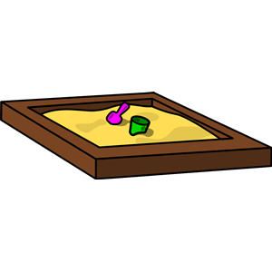

# Adding a picture here!

## Next level heading first, though
)
)
Adding two pictures, hoping that they will be displayed. Using the menuitem with image.
Error on second image. Unclear why - clipart used elsewhere.
Result: none showed up....
Dragging page media to the cryptic symbols here.
Result: both show up, very large indeed. The symbols are displayed too. Strange.

## Adding picture without the cryptic symbols from the menu

But how do I adjust the size and placement? I don't see any options for this.
How would we create a nice card with text and image? Probably some add-on or template???
Interesting. This picture is inline. I wonder why? It is on a separate row from the text content.

## Some more tests
> Testing!

===
This was a summary delimiter

* Always good with a list
* One more item
* And a third

## Testing to create a gallery module from the top menu
This input page looks exactly the same as for a normal page even though it is a module for "gallery".
I added four pictures. 
I save the module but cannot preview it and it doesn't show up on the website.
What a mystery!

## Reading the manual and testing resizing
Dragging in the image as I haven't saved it in the images folder (wherever that is). AFter the name, adding resize=100,50.
It didn't work. Removing the "n567621" after the file name and and ? before resize.

Result: removing the name, adding a ? and the resizing command did the trick. Not full intuition but possible to learn.

The manual is a bit painful to scan. I don't find what I need but maybe I need a theme or template to create nice looking content.

### Conclusion
"Easy" interface but very shallow. I don't understand how to make any adjustments. Scanning the instructions didn't help as much as I hoped but then again, I only spent 5 min on it. 

